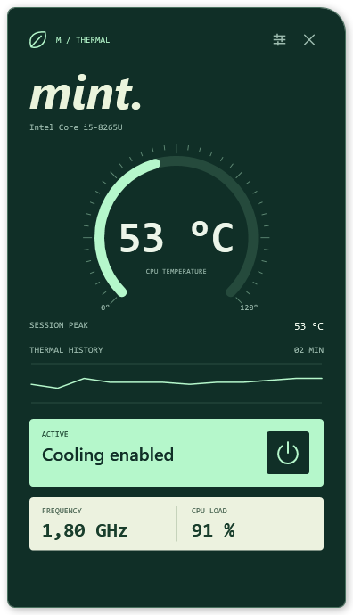
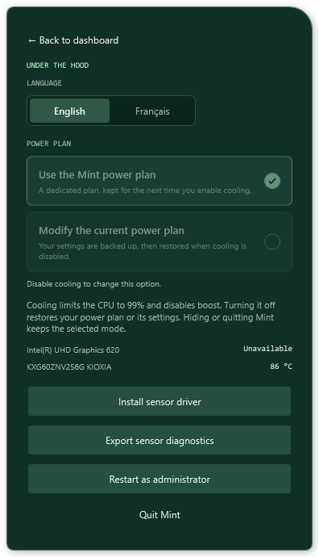

# Mint

Mint is a small Windows app that lives in the system tray. It shows your CPU temperature and lets you lower its power consumption with one click.

<p>
  
  
</p>

## Features

The dashboard shows CPU temperature, the session peak, a two-minute history, clock speed and load. GPU and storage temperatures appear in the settings when their sensors are available.

Cooling mode caps the CPU at 99% and disables boost, both on AC power and battery. There are two options:

- **Mint plan**: creates a dedicated power plan and reuses it each time you enable cooling.
- **Current plan**: saves the settings of your active Windows power plan before changing them.

Disabling cooling restores the previous plan or its settings. Hiding or quitting Mint leaves the selected mode active. Disable cooling before switching between the two options.

The interface starts in English. You can switch to French in the settings without restarting.

## Usage

Download `Mint-1.2.0-Setup-x64.exe` from the release assets and run it. The installer adds Mint to the Start menu and Windows' installed apps. Desktop and sign-in shortcuts are optional. It includes .NET; PawnIO is installed separately.

Run `Mint.exe`, then click the leaf icon next to the clock to open the panel. Right-click the icon for quick actions. Press Escape or click outside the panel to hide it.

CPU temperatures require the signed [PawnIO](https://pawnio.eu/) driver and may require running Mint as administrator. After installing the driver, quit and reopen Mint. You can also export a diagnostic report from the settings if a sensor remains unavailable.

If the hardware clock speed cannot be read, Mint uses the value reported by Windows. The tooltip shows the source; the Windows value may differ from a direct reading of the CPU cores.

Mint does not control fans. Cooling mode can reduce CPU performance.

Preferences and recovery backups are stored in `%LOCALAPPDATA%\Mint`. Keep these files while cooling is active. Data from previous versions is migrated automatically.

Disable cooling before uninstalling to restore your power plan. Uninstalling removes the app and its shortcuts, while keeping your preferences and recovery backups.

## Build

Requirements: 64-bit Windows and the [.NET 10 SDK](https://dotnet.microsoft.com/download/dotnet/10.0).

```powershell
.\Build-Mint.ps1
```

The script runs the tests, then publishes the app to `artifacts/Mint`. This build includes .NET, so the SDK is not needed on the PC running it.

To run just the tests:

```powershell
.\Build-Mint.ps1 -TestOnly
```

You can also open `Mint.sln` in Visual Studio. Application code is in `src/Mint` and tests are in `tests/Mint.Tests`. Power plan tests simulate `powercfg` and do not change Windows settings.

### Installer

Install [Inno Setup](https://jrsoftware.org/isdl.php) 6.4 or later, then run:

```powershell
.\Build-Installer.ps1
```

If the compiler is installed elsewhere, pass `-IsccPath 'C:\path\to\ISCC.exe'`. The script tests and publishes a fresh app build, then creates the versioned installer and its SHA-256 checksum in `artifacts/installer`. Upload the `.exe` and `.sha256` files as release assets. The installer supports English and French, installs for the current user, and upgrades previous installations in place.

## Origins and license

Mint builds on code from [Universal x86 Tuning Utility](https://github.com/JamesCJ60/Universal-x86-Tuning-Utility), by James C. Jones and the UXTU team. The app, its interface and its project structure are now maintained as Mint.

Original attribution: Copyright (C) 2024 James C.Jones.

The project is distributed under [GNU GPLv3](LICENSE), without warranty. Sensor readings use [LibreHardwareMonitor](https://github.com/LibreHardwareMonitor/LibreHardwareMonitor), licensed under the [Mozilla Public License 2.0](LICENSE-LibreHardwareMonitor.txt).
